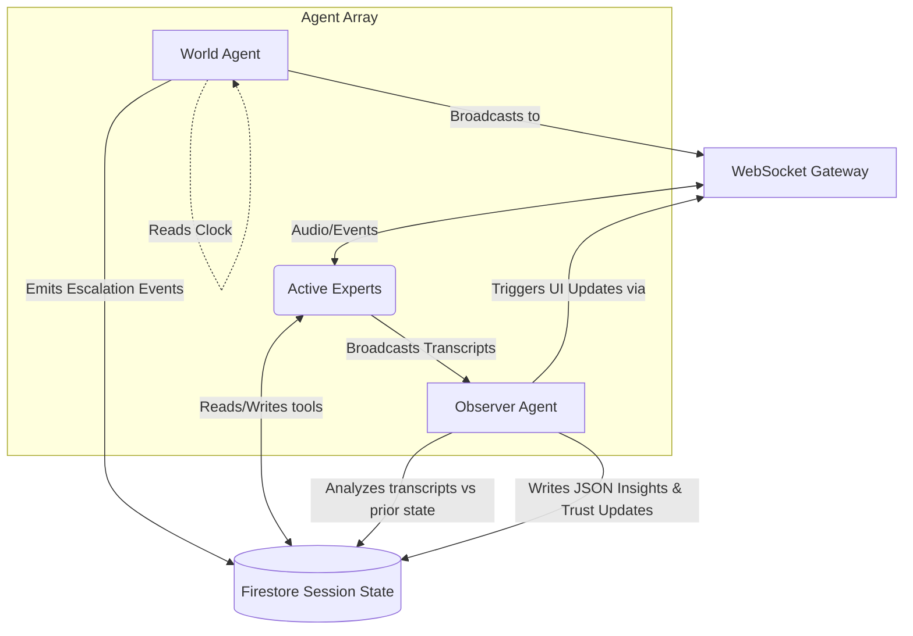

# WAR ROOM — Backend Architecture

The backend of the **WAR ROOM** application is a robust, asynchronous API built with [FastAPI](https://fastapi.tiangolo.com/). It serves as the central orchestration layer for a multi-agent AI crisis simulation platform, managing real-time communications, scenario generation, and autonomous agent behavior.

## Core Technologies

* **Framework:** FastAPI (Python 3.10+) running on Uvicorn.
* **AI Integration:**
  * **Google GenAI SDK:** For text-based agent reasoning and scenario generation.
  * **Gemini Live API:** For real-time conversational streaming and interaction logic.
  * **ElevenLabs:** For ultra-realistic text-to-speech (TTS) voice synthesis.
  * **LiveKit:** For WebRTC audio distribution and management.
* **Database & Storage:** Google Cloud Firestore (production state management) with an in-memory mock adapter for local development and testing.

## System Architecture

The backend codebase is modularized strictly into distinct domain directories:

### 1. Application Root (`/`)

* **`main.py`:** The FastAPI application entry point. Sets up the server, configuration, and mounts all Gateway routes.
* **`session_bootstrapper.py`:** The background worker that initializes new scenarios, seeds the database, and creates the AI agent roster when a crisis begins.

### 2. The Gateway (`/gateway`)

Handles all external front-facing communication with the Next.js client.

* **REST Routes:** Endpoints grouped by domain (e.g., `agent_routes.py`, `scenario_routes.py`, `intel_routes.py`) for fetching state and managing data.
* **WebSockets & Real-Time Sync:** `connection_manager.py` maintains active socket connections and broadcasts database events instantly. `chairman_audio_ws.py` receives the Director's raw microphone audio.
* **`chairman_handler.py`:** A dedicated orchestrator that receives the Director's inputs via WebSocket, parses the commands, and delegates them to the appropriate active Crisis Agents.

### 3. Autonomous Agent Ecosystem (`/agents`)

The brain of the simulation, consisting of isolated processes that interact over a shared database state.

* **`scenario_analyst.py`:** Generates the cohesive, intricate initial crisis scenario and designs the roster.
* **`dynamic_agent_factory.py`:** Dynamically spins up `CrisisAgent` instances on-the-fly with custom instructions (`SKILL.md`).
* **`base_crisis_agent.py`:** The foundational class defining an agent's reasoning loop using Gemini Live.
* **`world_agent.py`:** A timer-based escalation engine. It runs independently, injecting scheduled pressures (e.g., public outrage, stock crashes) into the database.
* **`observer_agent.py`:** Evaluates every spoken transcript against the session's recorded history to detect contradictions and update agent Trust Scores.
* **`voice_assignment.py`:** Maps unique voice personas to generated agents.

### 4. Audio Pipeline & Voice Engine (`/voice`)

* Modules like `livekit_session.py` and `pipeline.py` manage the orchestration of LiveKit, taking the ElevenLabs TTS streams and broadcasting them into the active WebRTC room to deliver localized audio to the frontend.

### 5. Utilities & Tools (`/utils` & `/tools`)

* **`/tools`:** Contains Function-Calling tool definitions (e.g., `crisis_board_tools.py`, `memory_tools.py`) that the Gemini models execute to read/write state.
* **`/utils`:** Core helpers, including `firestore_helpers.py` for DB I/O, `events.py` for publishing WebSocket messages, and `pydantic_models.py` for strict data validation.

---

## What Happens in the Simulation (The Chronological Flow)

To understand how these directories interact, here is the lifecycle of a War Room session:

1. **Initialization (The Setup):**
   * The Director (user) starts a session from the frontend using a prompt (e.g., "Cyberattack on grid").
   * The frontend hits `POST /api/sessions/` inside `gateway/scenario_routes.py`.
   * `/session_bootstrapper.py` fires off in the background. It calls `agents/scenario_analyst.py` to generate the threat, and `agents/dynamic_agent_factory.py` to spawn the expert personas (e.g., CISO, PR Director).
   * Initial state is written to Firestore (`utils/firestore_helpers.py`) and broadcast to the waiting UI.

2. **The Active Simulation (Real-Time Loop):**
   * The UI establishes WebSockets (`gateway/connection_manager.py`) to receive data, and an audio WebSocket (`gateway/chairman_audio_ws.py`) for the microphone.
   * **When the Director speaks:** `gateway/chairman_handler.py` routes the audio to Gemini for speech-to-text. The parsed text intent is passed into the `agents/base_crisis_agent.py` instances.
   * The active agent "thinks," potentially using `/tools` to update the Crisis Board (like officially deciding on a response), and formulates a reply.
   * The text reply is synthesized into real-time audio via ElevenLabs and streamed out through `/voice/pipeline.py` into LiveKit.

3. **Background Escalation (The Squeeze):**
   * While the Director debates with the experts, `agents/world_agent.py` ticks on a timer.
   * When an escalation is scheduled, it injects an event directly into the Firestore session and emits a broadcast (`utils/events.py`). The frontend instantly flashes an alert, and the Director must hastily pivot their strategy.

4. **Continuous Analysis (The Scorecard):**
   * After every single turn of dialog, `agents/observer_agent.py` silently reads the transcript.
   * It evaluates the agents' alignment, detects if the Director contradicted a prior command, and adjusts the session's hidden metrics (like "Trust Score" and "Public Posture"). These updates stream back down the WebSocket to silently update the UI bars.

5. **Resolution:**
   * The session hits a climax or the Director chooses to end it. The gateway processes shutdown tasks, cleanly disconnects the `/voice` WebRTC pipes, kills active LLM loops, and logs the final After Action Report based on the Observer's insights.

---

## Running the Application

Please refer to the root `README.md` for standard environment setup and installation instructions. Environment variable specifications can be found in `.env.example`.
