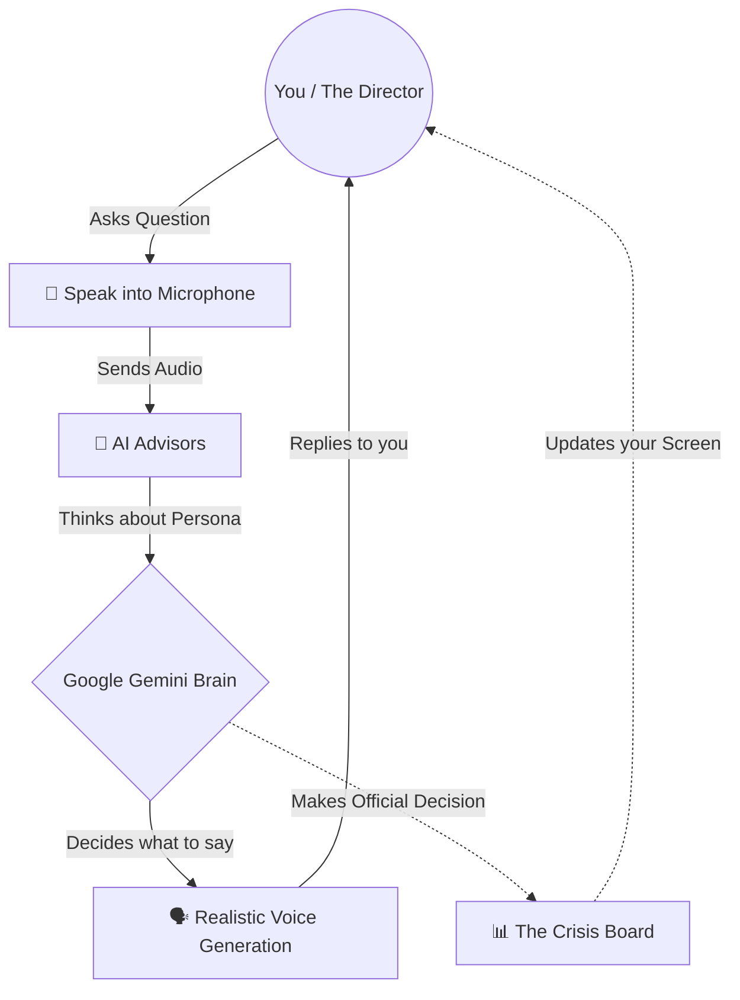
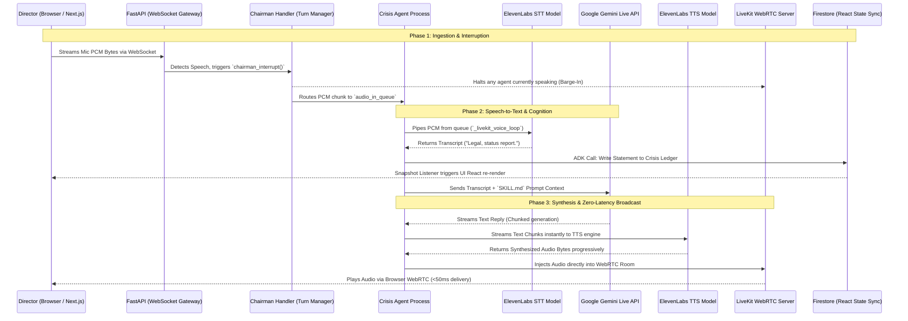

# WAR ROOM: Detailed System Architecture & Integration Guide

Welcome to the WAR ROOM technical documentation. This document is a deep dive into how we achieve a seamless, multi-agent, voice-driven simulation using some of the most advanced real-time AI streaming technologies available.

Whether you are a developer looking for exact implementation specifics or a stakeholder needing to understand the structural robustness and performance benchmarks of the platform, this guide covers the entire network topology and chronological data flow.

---

## 🗺️ System Topology & Network Pathways

To maintain the illusion of presence, WAR ROOM relies on a heavily decoupled architecture consisting of **WebSockets** for command/control, **WebRTC (LiveKit)** for zero-latency audio pipelines, **Firestore** for real-time state synchronization, and **Google Gemini** for agent cognition.

### The Director's View (Non-Technical Flow)

Before diving into the complex backend architecture, here is a simplified look at what happens conceptually when you interact with the WAR ROOM simulation.

### The Engineer's View (Detailed Technical Sequence)

To achieve the "illusion of presence" with low-latency audio, the system coordinates multiple decoupled services.

---

## ⚙️ Core Subsystem Deep Dives

### 1. The Gateway & Chairman Handler (`gateway/`)

The Gateway is the nervous system connecting the Next.js frontend to the Python backend.

- **WebSocket Routing (`chairman_audio_ws.py`)**: Accepts continuous chunks of raw PCM audio from the user's microphone over a binary WebSocket.
- **The Orchestrator (`chairman_handler.py`)**: It doesn't just pass audio—it manages the **Turn Manager**. If a Crisis Agent is currently speaking and the Director speaks, the `chairman_interrupt()` fires, instantly halting the agent's TTS stream to allow "barge-in" capabilities. Furthermore, if the Director is silent, the `start_discussion_loop()` background task forces the agents to debate each other, moving through predefined `intro` and `debate` phases autonomously.

### 2. The AI Pipeline: Google Gemini & ADK (`agents/`)

Instead of one massive LLM pretending to be multiple people, WAR ROOM instantiates individual, isolated `CrisisAgent` classes running concurrently.

- **Cognition**: Agents utilize the `google.genai` SDK for streaming conversational intelligence. They process the crisis brief and their `SKILL.md` instructions to formulate context-aware responses.
- **The Google ADK**: For rigid operations (like writing intelligence or finalizing a decision), agents use the **Google Agent Development Kit (ADK)** (`LlmAgent`, `Runner`, `InMemorySessionService`). This strictly enforces function calling, linking tools directly to Firestore operations.
- **Gemini TTS Fallback**: As a resilience mechanism, if ElevenLabs goes down, `_speak_via_gemini_tts` intercepts the pipeline and uses `google.genai.Client` to directly request the `AUDIO` modality from Gemini's native TTS engine, seamlessly recovering the voice pipeline.

### 3. Voice Synthesis & Recognition: ElevenLabs

The heavy lifting of voice is offloaded to the ElevenLabs LiveKit plugins.

- **STT (Speech-to-Text)**: While the session is active, the agent runs a `_livekit_voice_loop()`. It drains audio from the `audio_in_queue` and streams it to the `elevenlabs/scribe_v2_realtime` STT model to parse what the Director said.
- **TTS (Text-to-Speech)**: As Gemini streams text back, the text chunks are instantly piped into `elevenlabs/{tts_model}`. Because ElevenLabs operates via WebSockets in this setup, it begins generating and returning audio bytes *before* Gemini has even finished writing the complete sentence, ensuring ultra-low Time-To-First-Byte (TTFB).

### 4. Audio Broadcasting: LiveKit WebRTC (`voice/`)

Transmitting raw audio over HTTP is too slow for normal conversation.

- **The Pipeline**: We deploy a specialized LiveKit WebRTC server. The backend utilizes `build_livekit_agent_session_config` to construct an `stt-llm-tts` configuration.
- **Multimodality & Barge-In**: The LiveKit integration is explicitly configured with `allow_interruptions=True` and `chairman_interrupt_priority=True`. This allows the WebRTC channel to natively handle echo cancellation and drop its own audio buffer the millisecond the Director decides to speak.

### 5. Memory & State Management: Firestore Database

- **The Ledger**: Firestore enforces strict boundary mechanics. A `CrisisAgent` cannot read another agent's memory directly; it must ask the database.
- **Snapshots**: Every time an agent uses an ADK tool to update the `open_conflicts` or `agreed_decisions` array on the shared `CRISIS_SESSIONS` document, the Next.js frontend (which has a live snapshot listener attached to that document) instantly re-renders the React components, achieving real-time dashboard updates without polling the API.

---

## ⏱️ Performance & Latency Benchmarks

To achieve the "illusion of presence", the system must operate within human conversational latency thresholds (under ~1.5 seconds end-to-end). Here are the expected performance benchmarks of the WAR ROOM pipeline under optimal network conditions:

| Operation | Component | Expected Latency | Notes |
| :--- | :--- | :--- | :--- |
| **Mic to Backend** | Next.js -> WebSocket | `~ 100 - 200ms` | Network transmission of chunked PCM over WS. |
| **STT Processing** | ElevenLabs Scribe | `~ 300 - 500ms` | Dependent on chunk buffering; fires upon endpointing. |
| **LLM Reasoning (TTFB)**| Google Gemini API | `~ 500 - 900ms` | Time-to-First-Byte dependent on API saturation and prompt complexity. |
| **TTS Generation** | ElevenLabs TTS | `~ 300 - 600ms` | Begins working the moment the first punctuation mark escapes the LLM. |
| **Broadcast Delivery** | LiveKit WebRTC | `~ 100 - 150ms` | WebRTC transmission to the browser's audio context. |
| **Total perceived latency** | **Voice-to-Voice** | **~ 1.5s to 2.5s** | *Current real-world performance.* This is slightly higher than ideal human conversation and is an active area for backend optimization (e.g., tighter chunking, persistent LLM connections). |

---

## 🔄 The Comprehensive Chronology (A 2-Second Lifecycle)

When the Director presses the spacebar and says, *"Legal, status report,"* this specific chain reactions fires:

1. **Ingest**: Browser captures microphone PCM bytes, chunks them, and sends them securely via the `/api/ws/audio` route.
2. **Interrupt**: `chairman_handler.py` catches the bytes, calls `TurnManager.chairman_interrupt()` to halt anyone else speaking, and pipes the bytes to the `LegalAgent`'s `audio_in_queue`.
3. **Transcribe**: `base_crisis_agent.py`'s `_livekit_voice_loop()` wakes up, reads the queue, and sends the bytes to ElevenLabs STT. It receives the string: *"Legal, status report."*
4. **Reasoning**: The `LegalAgent` calls `genai.generate_content_stream` requesting an answer based on its specific `SKILL.md` (which instructs it to act legally defensive).
5. **Synthesis**: As Gemini streams the text *"Our exposure is currently contained..."*, the agent loops over the text chunks and pushes them into ElevenLabs TTS.
6. **Streaming**: ElevenLabs TTS immediately spits out a WebRTC audio frame containing the synthesized voice.
7. **Delivery**: The audio frame is injected into the LiveKit Room and played on the Director's speakers via the local AudioContext.
8. **Analysis (Post-Turn)**: While the audio plays, the separate, silent `ObserverAgent` reads the transcript of what Legal just said, determines if it was helpful or risky, and pushes an updated "Trust Score" payload to Firestore via ADK function calling — instantly updating the Director's UI dashboard.
